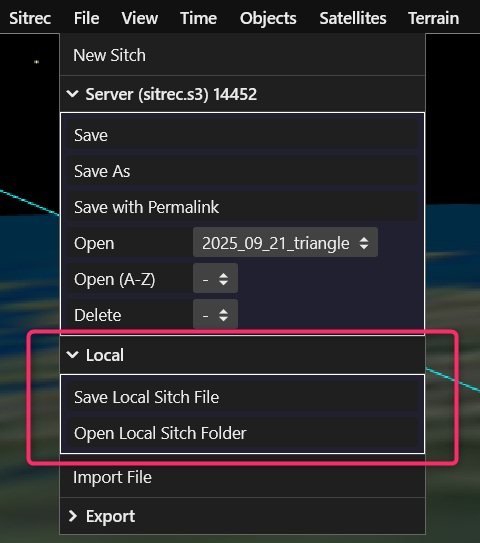

# Sitrec Browser Compatability

Sitrec is a web application that will run in any popular desktop browser like Chrome, Safari, Edge, or Firefox. 
However, not all browsers are equal. Below is listed known issues with some browsers.

## Local Filesystem Access

For security reasons not all browsers support local filesystem access. This is required for the local File menu items shown:-

| Browser | Capable |
|---------|-----|
| Chrome  | Yes |
| Edge    | Yes |
| Firefox | No  |
| Safari  | Yes |
| Brave   | [No by default but also see](https://github.com/brave/brave-browser/issues/29411#issuecomment-1534565893) |

